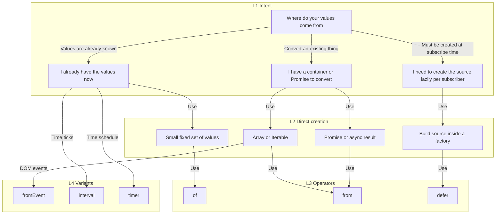

# Creation / Generation v1 — Use Cases + Decision Tree

> Copy/paste into: `docs/operators/groups/01-creation-generation.md`

---

## Dominant use cases (10)

* **C-01 Static seed values** — Start a pipeline with a small fixed set of values (fixtures, demo data, bootstrapping).
* **C-02 Convert existing data structures** — Turn an Array/Iterable into a stream to reuse the RxJS pipeline toolbox.
* **C-03 Promise and async interop** — Convert a Promise into a stream so it composes with operators (and can be cancelled at the subscription boundary even if the Promise cannot).
* **C-04 DOM event streams** — Model UI interactions (click, input, keydown, scroll) as streams.
* **C-05 Time-driven sources** — Produce periodic ticks for polling, progress, animation, sampling, or cadence control.
* **C-06 Lazy per-subscription creation** — Ensure each subscriber gets a fresh source (fresh timestamp, new request, new random seed, new resource).
* **C-07 Resource lifecycle binding** — Acquire resources on subscribe and release them on unsubscribe/complete (sockets, WebSocket connections, event listeners).
* **C-08 Conditional source selection** — Choose a different source at runtime based on environment or state (feature flags, auth state, online/offline).
* **C-09 Controlled termination sources** — Represent “emit nothing,” “never completes,” or “fail immediately” in a precise way for composition and tests.
* **C-10 Deterministic test inputs** — Create stable, replayable sources for marble tests and documentation examples.

---

## Specialization decision tree (choose `of` vs `from` vs `defer`)

### Leaf notes

* Choose **`of`** when you want to **emit specific values you already have** (literal values, small fixed set, seed values).
* Choose **`from`** when you want to **convert** an existing container into a stream:

  * Array/Iterable → emits items
  * Promise → emits the resolved value (or errors)
* Choose **`defer`** when the source must be **constructed at subscription time** (fresh side effects per subscriber).

### Variant notes

* If the “existing thing” is a **DOM event source**, use **`fromEvent`** (specialized conversion for event targets).
* If the “values come from time,” use **`interval`** (regular cadence) or **`timer`** (one-shot delay or delayed start + cadence).
